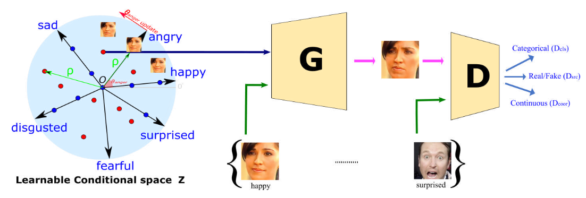
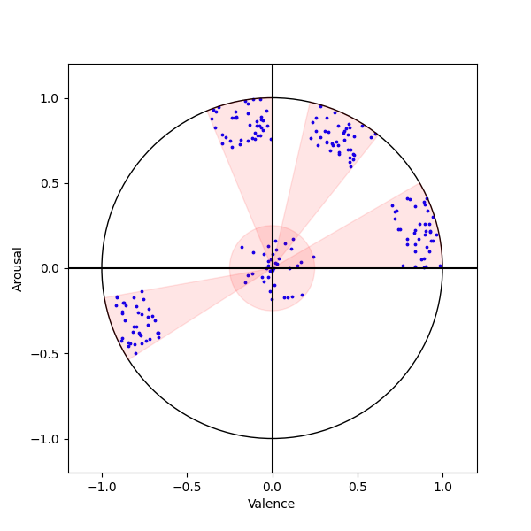

# [DeepLearning深度学习]Emotional Talking Head Generation项目

本项目旨在梳理和总结本人在**Emotional Talking Head Generation**方向的学习和工作

**"Emotions shape ourselves, determine who we are, and affect our daily behaviors"**

## 方向概述

个人理解：Talking Head Generation这个方向在于生成真实的人脸图像或者连续真实的人脸视频帧，目前已经有一定的发展；然而，可以精确控制**Face Emotion、Lip Movement、Talking Style、Blink、Regional Facial Movement**这些人脸细节的方法仍在探索中，因此产生**Emotional Talking Head Generation**这条道路。目前，主要是以**3DMM**和**GAN**作为核心，以**Blend、Alignment**等等方法作为辅助去探索新的框架和优化约束方法。


Example From NED（CVPR2022）


## 更新列表-2023.03.26

- [ ] 方向脉络梳理
- [ ] 复现工作
  - [ ] GANmut（CVPR2021）
  - [ ] IC-face（WACV2020）
  - [ ] DSM（ECCV2022）
- [ ] Our work


## 一、方向脉络梳理

### Based on 2D image

- GANmut（CVPR2021）

  - [GANmut](https://openaccess.thecvf.com/content/CVPR2021/papers/dApolito_GANmut_Learning_Interpretable_Conditional_Space_for_Gamut_of_Emotions_CVPR_2021_paper.pdf)
  - 摘要：
  - 细节：

  

- ICface（WACV2020）

  - [ICface](https://arxiv.org/pdf/1904.01909.pdf)
  - 摘要：
  - 细节：

  

- 

### Based on 3DMM

- NED（CVPR2022）

  - [NED](https://arxiv.org/pdf/2112.00585.pdf)
  - 摘要：
  - 细节：

  

- DSM（ECCV2022）

  - [DSM](https://arxiv.org/pdf/2111.07902.pdf)
  - 摘要：
  - 细节：

  

- 


## 二、复现工作

### DSM

由于本论文作者没有开源代码，本人只能尝试按照论文中描述的细节去尽可能地还原效果，复现代码即将公布

[论文链接](https://arxiv.org/pdf/2111.07902v2.pdf)


本文的整体网络框架

#### Framework

##### Person-specific dataset of facial expressions

- Valence-arousal values

  参考[Emonet论文](https://github.com/face-analysis/emonet)

- 3D expression coefficients

  参考[head2head++](https://github.com/michaildoukas/head2head)

##### Expression decoder network

参考原论文描述

```
The network consists of 6 fully-connected layers with 4096, 2048, 1024, 512, 128 and 64 units per layer respectively and with Rectified Linear Units (RELU) to introduce non-linearities
```

- 模型本质

  训练出2D的人脸VA向量到3D表情向量exp50的映射（**此处选用了DECA作为人脸重建方法，和原论文中的exp30有不同，但本质思想都是一样的**）是一个person-specific的模型映射，需要**针对不同object进行训练**

- 网络结构

  - 6层的fully connected layers：4096, 2048, 1024, 512, 128 and 64
  - 激活函数：relu
  - 防止过拟合：dropout

- 训练细节

  - 训练率：e-3
  - batchsize：32
  - 优化器：Adam
  - epoch：1000

##### Synthesis of photorealistic manipulated videos


#### Implement

代码实现非官方提供的，是本人自己实现的，如有错误，欢迎指导和交流

##### Dataset Prepare

- Valence-arousal values

  ```shell
  ./scripts/read_va_test_name.sh train
  ./scripts/emonet_test.sh train
  ```

  可以使用一下代码实现VA space的可视化

  ```shell
  ./scripts/show_va_space.sh
  ```

  以下是训练集中每个ID的VA space可视化结果

  

  

  

- 3D expression coefficients

  ```shell
  ./scripts/pre_all.sh
  ```

  

##### Train

- Expression decoder network

  ```shell
  ./scripts/train_expDecoder.sh train
  ```

  

- Renderer

  ```shell
  ./scripts/train_renderer.sh
  ```

  

##### Test

- emotion label ---> VA value

  使用一下代码可以进行emotion label到VA space的随机采样，并且进行B-spline interpolation，从而实现VA pair和时间序列帧的一一对应

  ```shell
  ./scripts/show_va_space.sh
  python ./EmoNet/caiyang.py
  ```

  随机采样结果如下：

  

  B-spline interpolation结果如下：

  ```shell
  此处暂时不做此操作
  ```

- 2D VA vector ---> 50D expression vector

  使用训练好的person-specific的expression decoder来推理出50D expression vector

  ```shell
  ./scripts/label2exp.sh
  ```

- 50D expression vector ---> generated frames

  使用renderer将nmfc和eye videos映射为frame images

  ```shell
  ./scripts/postprocess.sh
  ```
  
  


## 三、知识点总结

[机器学习常见metric](https://zhuanlan.zhihu.com/p/539920065?utm_id=0)

[Dataloader](https://blog.csdn.net/u014426939/article/details/124478339)


## Reference

**Thanks to：**

[DSM](https://arxiv.org/pdf/2111.07902v2.pdf)

[Emonet](https://github.com/face-analysis/emonet)

[head2head++](https://github.com/michaildoukas/head2head)

[Emonet论文](https://www.nature.com/articles/s42256-020-00280-0.epdf?sharing_token=8UEdDpr-K7UpoDi5SYjGLtRgN0jAjWel9jnR3ZoTv0NmJm5LtKLATZX-wg4Cg96PU_Xagw0dC67imfvbYZzOaFRYUs-6qIlabUXidsXjQRkYDNWUaArHiGy8zxyz2DozptfHYg3G_HumDAHYUwgV2PRTjKDd-8LKGzbMstnxIxY%3D)
